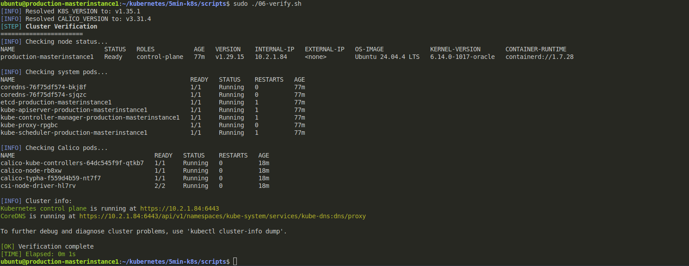

# KubeForge

Fast Kubernetes cluster setup using kubeadm + Calico in under 5 minutes.

## Features

- Pre-pulled container images for instant deployment
- Optimized for speed (<5min install time)
- Single-node and multi-node support
- **Auto-installs latest Kubernetes version**
- **Auto-installs latest Calico version**
- Calico CNI for networking
- Auto-removes control-plane taint (pods can run on master)
- Idempotent scripts (safe to re-run)

## Requirements

- Ubuntu 22.04/24.04 LTS (primary) or Debian 10/11/12
- 2+ CPUs, 2+ GB RAM
- Root access (sudo)

## Time Breakdown (Typical)

| Step | Time |
|------|------|
| Prerequisites | ~1-2 min |
| Pull images | ~1 min |
| kubeadm init | ~30 sec |
| Calico deploy | ~30 sec |
| **Total** | **~3-4 min** |


## Project Structure

```
kube-forge/
├── config.env              # Configuration variables
├── scripts/
│   ├── 00-common.sh        # Shared functions
│   ├── 01-prerequisites.sh  # System setup (all nodes)
│   ├── 02-pull-images.sh   # Pre-pull k8s images
│   ├── 03-master.sh        # Initialize master
│   ├── 04-worker.sh        # Join worker node
│   ├── 05-calico.sh        # Install Calico CNI
│   ├── 06-verify.sh        # Verify cluster
│   ├── 10-all-in-one.sh    # Single-node install
│   └── 99-uninstall.sh     # Complete uninstall
└── README.md
```
## Configuration

Edit `config.env` to customize:

| Variable | Default | Description |
|----------|---------|-------------|
| K8S_VERSION | latest | Kubernetes version (auto-resolves to latest) |
| POD_CIDR | 192.168.0.0/16 | Pod network CIDR |
| SERVICE_CIDR | 10.96.0.0/12 | Service network CIDR |
| CALICO_VERSION | latest | Calico version (auto-resolves to latest) |


## Quick Start

### Single-Node Cluster

```bash
cd /home/sydney/Workstation/kubenetes/k3s/installation/kube-forge/scripts
sudo bash 10-all-in-one.sh
```

### Multi-Node Cluster

**On ALL nodes (run as root):**
```bash
cd /home/sydney/Workstation/kubenetes/k3s/installation/kube-forge/scripts
sudo bash 01-prerequisites.sh
```

**On MASTER node:**
```bash
sudo bash 02-pull-images.sh
sudo bash 03-master.sh
sudo bash 05-calico.sh
```

**On WORKER nodes:**
```bash
# Get join command from master:
# cat /tmp/join-command.txt

sudo bash 04-worker.sh "<join-command>"
```

**Verify (on master):**
```bash
sudo bash 06-verify.sh

```



### Check kubelet status
```bash
systemctl status kubelet
journalctl -u kubelet -n 50
```

### Reset and retry
```bash
sudo bash 99-uninstall.sh
```

## Troubleshooting

### Cluster not ready
```bash
kubectl get nodes
kubectl get pods -A
kubectl describe nodes
```
### Certificates errors 
when we face certifications errors we need
```
we need to copy the the config file that was created 
sudo cp /etc/kubernetes/admin.conf ~/.kube/config
```
### kubectl to Apiserver communication errors 
when we face kubectl communication to the apiserver 
```
WORKERS
#### we need to copy the right certification from the control plane to the the workers 

#### On the control plane 
cat /etc/kubernetes/admin.conf
#### on the worker 

mkdir -p $HOME/.kube
vim  $HOME/.kube/config
# Paste the text, save and exit
sudo chown $(id -u):$(id -g) $HOME/.kube/config


```